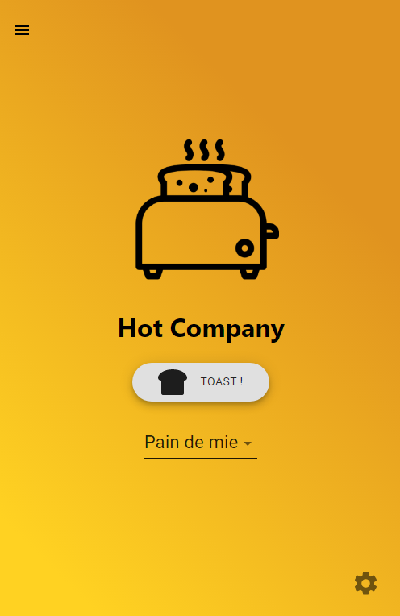

<h1 align="center">Hot Company 🍞</h1>
A web application to control a homemade connected toaster  

 
 

## GPIO Controller

### Install dependencies
`pip3 install pycnic`  
`sudo apt-get install gunicorn3`

### Run server

`gunicorn3 -b 127.0.0.1:5100 server:app`
## Front

### Install packages
`npm ci`

### Run server

`npm start`

## Maintainers
This project is mantained by:
* [Baptiste LECHAT - baptistelechat](https://github.com/baptistelechat)
* [Léopold BRIAND - LeopoldBriand-bot](https://github.com/LeopoldBriand-bot)
* [Charly LERENARD - FoxbandyKoot](https://github.com/FoxBandyKoot)
* [Can SESEN - Hyddrax](https://github.com/Hyddrax)

## Screenshots

